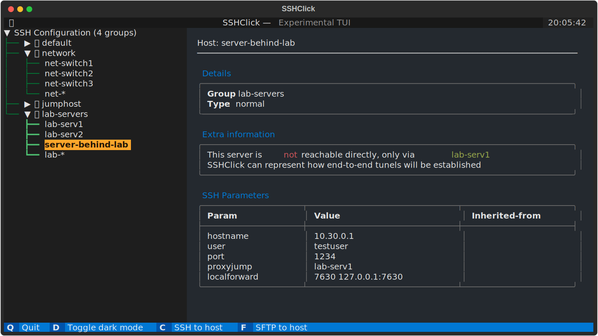

# SSH Click Config manager (sshclick)


## Links

- [Intro](https://github.com/karlot/sshclick#intro)
- [Why?](https://github.com/karlot/sshclick#why)
- [What does it do](https://github.com/karlot/sshclick#what-does-it-do)
  - [Installation procedure](https://github.com/karlot/sshclick#installation-procedure)
  - [Upgrade procedure](https://github.com/karlot/sshclick#upgrade-procedure)
  - [Uninstall procedure](https://github.com/karlot/sshclick#uninstall-procedure)
- [SSH Config structure](https://github.com/karlot/sshclick#ssh-config-structure-and-important-note-about-comments)
  - [Comment blocks and metadata](https://github.com/karlot/sshclick#comment-blocks-and-metadata-in-ssh-config)
- [Example usage and features](https://github.com/karlot/sshclick#example-usage-and-features)
  - [Group commands and options](https://github.com/karlot/sshclick#group-commands-and-options)
  - [Host commands and options](https://github.com/karlot/sshclick#host-commands-and-options)
  - [Config commands and options](https://github.com/karlot/sshclick#config-commands-and-sshclick-configuration-options)
  - [Output styling and user ENV variables](https://github.com/karlot/sshclick#output-styling-and-user-env-variables)
<!-- - [Recorded demos](https://github.com/karlot/sshclick#recorded-demos)
  - [sshc group operations](https://github.com/karlot/sshclick#demo-showing-some-sshc-group-operations)
  - [sshc host operations](https://github.com/karlot/sshclick#demo-showing-some-sshc-host-operations) -->
- [Author](https://github.com/karlot/sshclick#author)
- [License](https://github.com/karlot/sshclick#license)


## Intro
Terminal based assisted management of your SSH config files.  
Built out of boredom with managing messy and huge ssh_config files.  

Backup your SSH config files before using!  
SSHClick can be used with "show" and "list" commands for hosts, without modifying your SSH Config in any way!  

**Only commands that modify configuration will edit and rewrite/restructure your SSH Config file. In that case, any added comment or infos that are not in form that SSHClick understand will be discarded, and configuration will be re-formatted to match SSHClick style. See below details to understand how SSH Click would keep your config organized**

**NEW!** *Now comes with additional TUI that can be accessed via `sshc tui` or `ssht`.*  




## Why?

* I need something that works fast and great in terminal, and does not require complex setup.
* SSH config is the only config I need to backup.
* SSH config is very feature-full with all options SSH client support, why inventing extra layer?
* I need quick way to search, group and visualize all hosts inside SSH configuration (especially since it can grow huge)


## What does it do?

SSHClick (sshc) is just a tool designed to work with existing SSH configuration files on your Linux/Windows/WSL terminal environment.  
It parses your SSH config, and can provide easy commands to list, filter, modify or view specific Host entries.
Trough additional "metadata" comments it can add abstractions such as "groups" and various information that is both readable in the configuration file, and can be parsed and printed while using the tool.


### Installation procedure

1. **Check preconditions:**
    - Currently only tested on Linux (Debian 10,11, Ubuntu 20.04,22.04), but should work on other systems as well
    - Minimum python3.7 (tested up to 3.11 beta) & pip installed
        - it is preferable to not use system python version, to install "custom" user python on linux, you can try using pyenv (https://github.com/pyenv/pyenv
    - git installed

2. **Install package:**
    - from PyPI using pip
        ```
        pip install sshclick
        ```

    - (OR) from source using pip
        ```sh
        git clone https://github.com/karlot/sshclick
        cd sshclick
        pip install .
        ```

3. Use it as you like, `sshc` command should be available to access SSHClick application, see below chapter for basic [usage](https://github.com/karlot/sshclick#example-usage-and-features)

4. Install shell autocompletion (_TAB-TAB auto-completes on commands, options, groups and hosts_)
    * __Bash__ - Add this line to end of your `~/.profile` file:
      ```sh
      eval "$(_SSHC_COMPLETE=bash_source sshc)"
      ```
    * __Zsh__ - Add this line to end of your `~/.zshrc` file:
      ```sh
      eval "$(_SSHC_COMPLETE=zsh_source sshc)"
      ```


### Upgrade procedure

* Upgrade from new PyPI release:  
  ```sh
  pip install --upgrade sshclick
  ```

* Upgrade from source:
  Assuming installation is already done, and previous version is cloned in some local folder

  ```sh
  cd sshclick     # cd into existing previously cloned repo folder
  git pull
  pip install --upgrade .
  ```


### Uninstall procedure
Simply run:
```
pip uninstall sshclick
```

In case you have installed from cloned source code, you can delete locally cloned repo.
```sh
rm -r sshclick
```

---

## SSH Config structure, and important note about comments

SSHClick when editing and writing to SSH config file must use specific style, and is internally using comments to "organize" configuration itself. This means comments outside of what sshclick is handling are unsupported and will be lost when SSHClick modifies a file.)


### Comment blocks and metadata in SSH Config

SSHClick uses comments to add extra information which it can use to add concept of grouping and extra information to hosts. Special "metadata" lines start with `#@` followed by some of meta-tags like `group`, `desc`, `info`. This are all considered group metadata tags, as they apply on the group level. Note that line separations above and below "group header" are added only for visual aid, they are ignored at parsing, but are included when modifying/generating SSH config file.  

This "headers" can be added manually also in SSH config, or sshclick can add them and move hosts under specific group, using `sshc` cli tool

Normally start of the "GROUP HEADER" inside SSH Config would look like below.  
- `#@group:` is KEY metadata tag, that during "parsing" defines that all hosts configured below this "tag" belong to this group
- `#@desc:` is optional tag that adds "description" to defined group, and will display in usual group display commands
- `#@info:` is optional tag that can appear multiple times, adding extra information lines tied to the group.

Additionally each "host" definition can have optional meta info:
- `#@host:` is optional tag that can appear multiple times, that can hold some information about the host, this meta info when defined applies to next "host" definition that will appear. If this key is added after "host" keyword, it will be applied to next host, for that reason, keep this host meta info above the actual host definition.

Following is sample how group header is rendered by SSHClick:
```
#-------------------------------------------------------------------------------
#@group: <GROUP-NAME>       [MANDATORY]   <-- This line starts new group
#@desc: <GROUP-DESCRIPTION> [OPTIONAL, SINGLE]
#@info: <GROUP-INFO-LINES>  [OPTIONAL,MULTIPLE]
#-------------------------------------------------------------------------------
Host ...    <-- this hosts definitions are part of the defined group
    param1 value1
    param2 value2

#@host: <HOST-INFO-LINES>   [OPTIONAL,MULTIPLE] <-- Adds info to following host
Host ...

<ANOTHER GROUP HEADER>
```

If there are no groups defined, then all hosts are considered to be part of "default" group. SSHClick can be used to move hosts between groups and handle keeping SSH config "tidy" and with consistent format.


## Example usage and features

SSHClick is deploying `sshc` cli tool that allows interacting with your SSH Config file and perform various organization,listing, displaying and modification of SSH Group/Host configuration parameters.  
`sshc` comes with pre-built lots of help options so each level of commands provide `--help` options to provide you info what commands and options are available at which command level.  

For example to check version, type: `sshc --version`  
_Sample output:_
```console
$ sshc --version
SSHClick (sshc) - Version: 0.6.0
```

If you run `sshc` command alone, or adding `-h` or `--help` option, it will show help what else must be added to the command...  
_Example:_
```console
$ sshc --help
Usage: sshc [OPTIONS] COMMAND [ARGS]...

  SSHClick - SSH Config manager. version 0.6.0

  NOTE: As this will change your SSH config files, make backups before using
  this software, as you might accidentally lose some configuration.

Options:
  --sshconfig TEXT  Config file (default: ~/.ssh/config)
  --stdout          Send changed SSH config to STDOUT instead to original
                    file, can be enabled with setting ENV variable (export
                    SSHC_STDOUT=1)
  --version         Show the version and exit.
  -h, --help        Show this message and exit.

Commands:
  config  Modify SSHClick configuration trough SSH Config
  group   Command group for managing groups
  groups  Lists all groups
  host    Command group for managing hosts
  hosts   List configured hosts
  tui     TUI Interface (experimental)
```

### `group` commands and options

To manage "groups" type `sshc group --help` to see options.  
_Example:_
```console
$ sshc group --help
Usage: sshc group [OPTIONS] COMMAND [ARGS]...

  Command group for managing groups

Options:
  -h, --help  Show this message and exit.

Commands:
  create  Create new group
  delete  Delete group
  list    Lists all groups
  rename  Rename existing group
  set     Change group parameters
  show    Shows group details
```

### `host` commands and options

To manage "groups" type `sshc host --help` to see options.  
_Example:_
```console
$ sshc host --help
Usage: sshc host [OPTIONS] COMMAND [ARGS]...

  Command group for managing hosts

Options:
  -h, --help  Show this message and exit.

Commands:
  create   Create new host
  delete   Delete host(s)
  install  Install SSH key to hosts (experimental)
  list     List configured hosts
  rename   Rename existing host
  set      Set/Change host configuration
  show     Show current host configuration
  test     Test SSH host connection  (experimental)
```

### `config` commands and SSHClick configuration options

SSHClick does not to have its own configuration files, so most of configuration that it tries to understand, come from commands arguments/options, environment variables, and SSH Config file itself.

Sometimes when you want to persist some config options, not to repeat it via command, you can use ENV variables, that can be set trough user shell profile.

Now there is also option to store such config in SSH Config file itself (as metadata comment), so it can be portable and backed up together with SSH Config file.

Command `config` takes `set` or `del` commands that add or remove specific configuration.

_Example:_
```console
$ sshc config --help
Usage: sshc config [OPTIONS] COMMAND [ARGS]...

  Modify SSHClick configuration trough SSH Config

Options:
  -h, --help  Show this message and exit.

Commands:
  del  Delete config option
  set  Set config option
```


_Example: "Set host output style to 'card'"_
```console
$ sshc config set --help
Usage: sshc config set [OPTIONS]

  Set config option

Options:
  --host-style TEXT  Set how to display hosts in 'show' command.
                     Available:(panels,card,simple,table,table2,json)
                     (default: panels)
  -h, --help         Show this message and exit.

$ sshc config set --host-style card
```

This will now store config in "currently used" SSH config file as following:
```
#<<<<< SSH Config file managed by sshclick >>>>>
#@config: host-style=card
```

To delete this config, either remove the line from file manually, or use `sshc` command:
```console
$ sshc config del --host-style
```

### Output styling and user ENV variables

`sshc host show` can display host output is several formats, you can specify it with `sshc host show <host> --style <style>`  
Available styles are:

| Style              | Description                                       |
|--------------------|---------------------------------------------------|
| `panels` (default) | Display data in several panels                    |
| `card`             | Add data to single "card"                         |
| `simple`           | Simple output with minimal decorations            |
| `table`            | Flat table with 3 columns                         |
| `table2`           | Nested table with separated host SSH params       |
| `json`             | JSON output, useful for binding with other tools  |

If you want to have some style statically set for your shell, you can export ENV variable with `export SSHC_HOST_STYLE=table`, and add it to `.profile` or `.bashrc` or `.zshrc`, so its set when shell session is starting, to set "default" style to that one.  
Alternatively, you can use SSHClick internal "config" mechanism to store some config data into your SSH Config file (as commented metadata) so it can be backed up with your SSH config. To do so, you can use following command as example: `sshc config set --host-style table`.

In case user do not line "fancy" colors in output, you can set ENV variable to disable all color outputs with `export NO_COLOR=1`. If you want it permanently you can add it to startup "rc" files as well.


> NOTE! When sending output into non-terminal such as to file, SSHClick will recognize that and will remove all ANSI Escape characters (colors and stuff...) so that output is captured in clear way.


## Recorded demos

Following demos will use this config sample file as input (located in ~/.ssh/config):

```
#<<<<< SSH Config file managed by sshclick >>>>>

#-------------------------------------------------------------------------------
#@group: network
#@desc: Network devices in my lab
#@info: user='admin' password='password'
#@info: Not really, but for demo its ok :)
#-------------------------------------------------------------------------------
Host net-switch1
    hostname 10.1.1.1

Host net-switch2
    hostname 10.1.1.2

Host net-switch3
    hostname 10.1.1.3

Host net-*
    user admin


#-------------------------------------------------------------------------------
#@group: jumphost
#@desc: Edge-server / SSH bastion
#@info: Used for jump-proxy from intnet to internal lab servers
#-------------------------------------------------------------------------------
#@host: This host can be used as proxyjump to reach LAB servers
Host jumper1
    hostname 123.123.123.123
    user master
    port 1234


#-------------------------------------------------------------------------------
#@group: lab-servers
#@desc: Testing/Support servers
#@info: Some [red]important[/] detail here!
#@info: We can have color markups in descriptions and info lines
#-------------------------------------------------------------------------------
#@host: This server is [red]not[/] reachable directly, only via [green]jumper1[/]
Host lab-serv1
    hostname 10.10.0.1
    user admin

#@host: This server is [red]not[/] reachable directly, only via [green]jumper1[/]
Host lab-serv2
    hostname 10.10.0.2

#@host: This server is [red]not[/] reachable directly, only via [green]lab-serv1[/]
#@host: SSHClick can represent how end-to-end tunels will be established
Host server-behind-lab
    hostname 10.30.0.1
    user testuser
    port 1234
    proxyjump lab-serv1
    localforward 7630 127.0.0.1:7630

#@host: This pattern applies to all hosts starting with 'lab-'
#@host: setting 'user' and 'proxyjump' property
Host lab-*
    user user123
    proxyjump jumper1

```
<!-- 
### Demo showing some `sshc group` operations:
[](https://asciinema.org/a/BQoVXv2HSeIvTyATeKUBGfr89)


### Demo showing some `sshc host` operations:
[](https://asciinema.org/a/wzLefl49CRErBoFwC6ir96FFA)


### Demo displaying "end-to-end" tunnel visualization in graph
[](https://asciinema.org/a/I4O2bfDiRAN7xEGdTB1S9rChE) -->


## Author

Karlo Tisaj  
email: karlot@gmail.com  
github: https://github.com/karlot


## License

MIT License

Copyright (c) 2023 Karlo Tisaj

Permission is hereby granted, free of charge, to any person obtaining a copy
of this software and associated documentation files (the "Software"), to deal
in the Software without restriction, including without limitation the rights
to use, copy, modify, merge, publish, distribute, sublicense, and/or sell
copies of the Software, and to permit persons to whom the Software is
furnished to do so, subject to the following conditions:

The above copyright notice and this permission notice shall be included in all
copies or substantial portions of the Software.

THE SOFTWARE IS PROVIDED "AS IS", WITHOUT WARRANTY OF ANY KIND, EXPRESS OR
IMPLIED, INCLUDING BUT NOT LIMITED TO THE WARRANTIES OF MERCHANTABILITY,
FITNESS FOR A PARTICULAR PURPOSE AND NONINFRINGEMENT. IN NO EVENT SHALL THE
AUTHORS OR COPYRIGHT HOLDERS BE LIABLE FOR ANY CLAIM, DAMAGES OR OTHER
LIABILITY, WHETHER IN AN ACTION OF CONTRACT, TORT OR OTHERWISE, ARISING FROM,
OUT OF OR IN CONNECTION WITH THE SOFTWARE OR THE USE OR OTHER DEALINGS IN THE
SOFTWARE.
